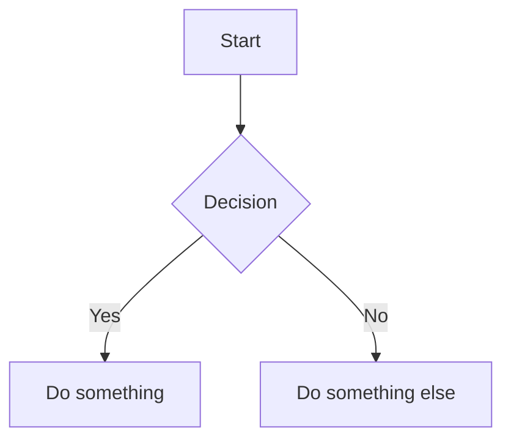
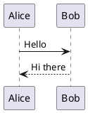

<objective>
Add support for rendering PlantUML and Mermaid diagrams in the markdown renderer.

This allows users to include diagrams in their conversations that will be rendered as actual visualizations rather than code blocks, making technical discussions more visual and understandable.
</objective>

<context>
This is a React/TypeScript chat application using:
- react-markdown for markdown rendering
- Material UI for components
- MarkdownRenderer component at ./src/components/common/MarkdownRenderer.tsx

The MarkdownRenderer currently handles:
- Standard markdown
- Code blocks with syntax highlighting
- Collapsible think blocks for DeepSeek R1

Read the CLAUDE.md for project conventions (TDD, SOLID, strong typing).
</context>

<requirements>
1. Detect Mermaid code blocks (```mermaid) and render as diagrams
2. Detect PlantUML code blocks (```plantuml) and render as diagrams
3. Handle rendering errors gracefully with error messages
4. Support both light and dark themes for diagrams
5. Diagrams should be responsive and fit within message bubbles
</requirements>

<implementation>
1. Install required packages:
   - `mermaid` for Mermaid diagram rendering
   - For PlantUML, use `plantuml-encoder` to encode and fetch from PlantUML server

2. Create diagram rendering components:
   - MermaidDiagram component that initializes mermaid and renders SVG
   - PlantUMLDiagram component that encodes and fetches from server

3. Modify MarkdownRenderer to use custom code block renderer that:
   - Detects language type (mermaid, plantuml)
   - Routes to appropriate diagram component
   - Falls back to syntax-highlighted code for other languages

4. Handle async rendering and loading states

5. Write comprehensive tests

Technical approach for PlantUML:
- Use plantuml-encoder to encode diagram text
- Fetch SVG from public PlantUML server: https://www.plantuml.com/plantuml/svg/{encoded}
- Cache rendered diagrams to avoid redundant fetches
</implementation>

<output>
Install packages (run these commands):
!npm install mermaid plantuml-encoder
!npm install -D @types/plantuml-encoder

Create new files:
- `./src/components/common/MermaidDiagram.tsx` - Mermaid rendering component
- `./src/components/common/PlantUMLDiagram.tsx` - PlantUML rendering component
- `./src/components/common/MermaidDiagram.test.tsx` - Tests
- `./src/components/common/PlantUMLDiagram.test.tsx` - Tests

Modify existing files:
- `./src/components/common/MarkdownRenderer.tsx` - Integrate diagram components
- `./src/components/common/MarkdownRenderer.test.tsx` - Add diagram tests
</output>

<verification>
1. Run `npm run lint` to check for linting errors
2. Run `npm run test` to ensure all tests pass
3. Test manually with sample diagrams:

Mermaid test:


PlantUML test:


4. Verify error handling with invalid diagram syntax
5. Verify diagrams render correctly in both user and assistant messages
</verification>

<success_criteria>
- Mermaid diagrams render as SVG graphics
- PlantUML diagrams render via PlantUML server
- Invalid diagrams show clear error messages
- All tests pass
- No linting errors
- Follows TDD approach
</success_criteria>
